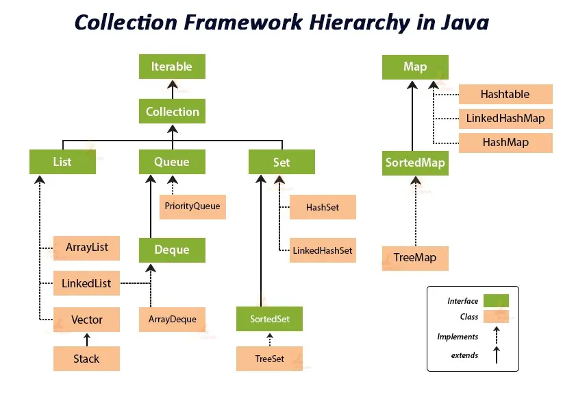

# Java Collection Framework & Arrays

This module introduces the Java Collection Framework and its core components, including ArrayList, LinkedList, Vector, Stack, Set, Map, and Queue. The Collection Framework provides a unified architecture for storing and manipulating groups of objects.

---

## Overview

- **Collection Framework:**  
  A set of classes and interfaces that implement commonly reusable collection data structures.
- **Array:**  
  Fixed-size, homogeneous data structure. Not part of the Collection Framework, but often used alongside collections.

---

## Collection Hierarchy

- **Iterable:** Root interface for all collections.
- **Collection:** Base interface for List, Set, and Queue.
- **List:** Ordered collection (ArrayList, LinkedList, Vector, Stack).
- **Set:** Unordered, unique elements (HashSet, LinkedHashSet, TreeSet).
- **Queue/Deque:** FIFO/LIFO structures (PriorityQueue, ArrayDeque).
- **Map:** Key-value pairs (HashMap, LinkedHashMap, Hashtable, TreeMap).

---

## Key Classes

- **ArrayList:** Resizable array, fast random access.
- **LinkedList:** Doubly-linked list, efficient insertions/deletions.
- **Vector:** Synchronized ArrayList, thread-safe.
- **Stack:** LIFO structure, extends Vector.
- **HashSet/LinkedHashSet/TreeSet:** Unique elements, different ordering.
- **HashMap/LinkedHashMap/TreeMap/Hashtable:** Key-value pairs, different ordering and thread-safety.
- **PriorityQueue/ArrayDeque:** Queue implementations.

---

## Example Usage

See [Main.java](./Main.java) for a simple example using `Vector`.

---

## How to Use

- Import the required collection class (`import java.util.*;`).
- Create an instance and use methods like `add()`, `remove()`, `get()`, etc.
- Collections are preferred over arrays for dynamic and complex data manipulation.

---

## Learn More

- [Java Collections Framework (Oracle Docs)](https://docs.oracle.com/javase/tutorial/collections/index.html)
- [ArrayList vs LinkedList vs Vector](https://www.geeksforgeeks.org/arraylist-vs-linkedlist-vs-vector/)
- [Java Arrays](https://docs.oracle.com/javase/tutorial/java/nutsandbolts/arrays.html)

---
