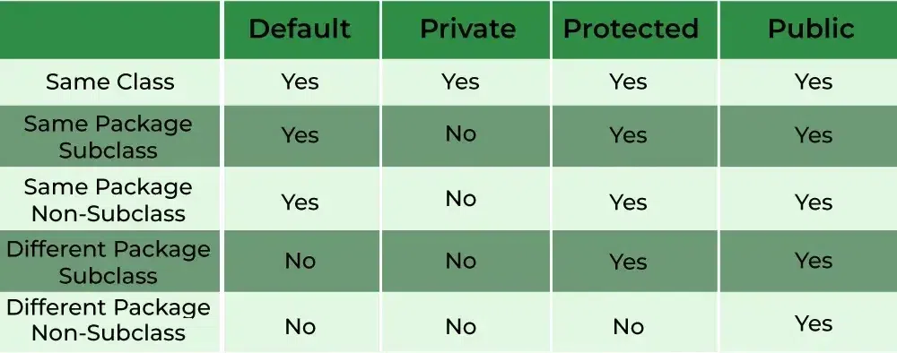

# Java Access Modifiers

Access modifiers in Java determine the visibility and accessibility of classes, methods, and variables. They help enforce encapsulation and control how code is accessed across packages and classes.

## Types of Access Modifiers

| Modifier   | Same Class | Same Package Subclass | Same Package Non-Subclass | Different Package Subclass | Different Package Non-Subclass |
|------------|:----------:|:---------------------:|:-------------------------:|:--------------------------:|:------------------------------:|
| **Default**    | Yes        | Yes                  | Yes                      | No                        | No                            |
| **Private**    | Yes        | No                   | No                       | No                        | No                            |
| **Protected**  | Yes        | Yes                  | Yes                      | Yes                       | No                            |
| **Public**     | Yes        | Yes                  | Yes                      | Yes                       | Yes                           |

### 1. **Private**
- Accessible only within the same class.
- Not visible to subclasses or other classes, even in the same package.
- Commonly used for encapsulation of sensitive data.
- Example: `private int num;`

### 2. **Default** (no modifier)
- Accessible within the same package.
- Not accessible from classes in different packages.
- Example: `String name;`

### 3. **Protected**
- Accessible within the same package.
- Accessible in subclasses, even if they are in different packages.
- Example: `protected int[] arr;`

### 4. **Public**
- Accessible from any other class in any package.
- Example: `public int getNum() { ... }`

> NOTE: The top-tier (OuterMost) classes cannot be either protected or private.

## Visual Representation

*(See attached images for table and diagram)*

## Example Usage

See [A.java](./A.java) and [Main.java](./Main.java) for practical examples of how access modifiers affect member accessibility.

- Private members can only be accessed via getter/setter methods.
- Default and protected members are accessible within the same package.
- Protected members are also accessible in subclasses outside the package.
- Public members are accessible everywhere.

## Summary

Access modifiers are essential for encapsulation and controlling visibility in Java. Use them appropriately to protect data and structure your code for maintainability and security.

> NOTE: A top-level/ Outer class cannot be Protected or Private because the top-level class itself must be discoverable from outside the file, which protected and private does not guarantee.
